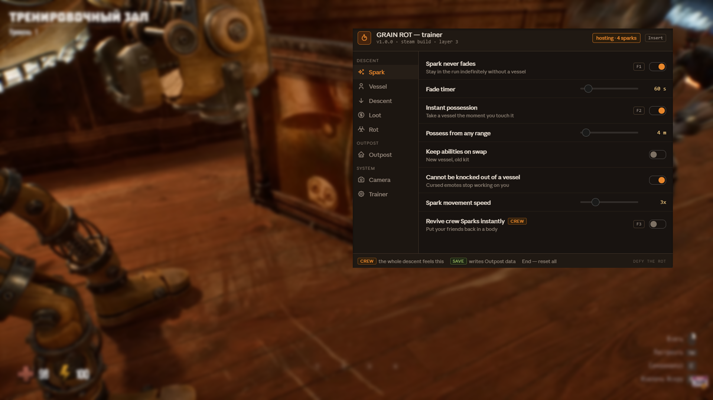

# GRAIN ROT Trainer — Mod Menu & Cheats for PC (v1.0.0)

**GRAIN ROT trainer** with an in-game **mod menu** built around the Spark: never fade out without a vessel, fireproof vessels, infinite gold, freeze the Corrupted, instant Outpost build, unlock all constructs — plus a fix for the negative room EXP bug and a rolling save backup. Works with the **Steam** release from Beck & Branch Games. Open the overlay with `Insert`, flip a toggle, ride the elevator back down.

> **[⬇ Download the latest GRAIN ROT trainer](https://github.com/poolrivertow88/Grain-Rot-Trainer/releases/latest)**

    

---

## Contents

- [What this is](#what-this-is)
- [It's co-op: read this first](#its-co-op-read-this-first)
- [Crew and save tags](#crew-and-save-tags)
- [Known game bugs this helps with](#known-game-bugs-this-helps-with)
- [Compatibility](#compatibility)
- [Features](#features)
  - [Spark](#spark--possession-and-death) · [Vessel](#vessel--your-wooden-body) · [Descent](#descent--the-dungeon) · [Loot](#loot--gold-and-hauling) · [Rot](#rot--corruption-system) · [Outpost](#outpost--base-building) · [Camera](#camera--visibility-options) · [Trainer](#trainer-options)
- [Hotkeys](#hotkeys)
- [Installation](#installation)
- [How to use the mod menu](#how-to-use-the-mod-menu)
- [Troubleshooting](#troubleshooting)
- [FAQ](#faq)
- [Changelog](#changelog)
- [Disclaimer](#disclaimer)

---

## What this is

*GRAIN ROT* is a co-op extraction horror builder. You're a Living Spark inside a fragile wooden vessel that splinters, collapses and catches fire. You ride a cursed elevator into shifting underground ruins with your crew, rip furniture out of the walls, feed the debris to the Grinder for gold, and try to get back up before the Corrupted close in. If everyone breaks, the loot is gone. What you do haul back rebuilds the Outpost, and a stronger Outpost is what lets you go deeper next time.

The clever bit is that death isn't an exit. When your vessel breaks the Spark escapes and stays in the run, drifting through the dark looking for another host before it fades out completely.

That system shapes this trainer. The single most useful option here isn't god mode — it's **Spark never fades**, which turns the worst-case scenario (bodiless, alone, timer running) into something survivable. Second is **Fireproof**, in a game whose tagline is that everything burns.

---

## It's co-op: read this first

GRAIN ROT is PvE with no competitive mode, no leaderboards and no anti-cheat, so nothing here is about beating other players. But it is a **shared session** for up to 20 people, and that changes what you should switch on.

**Options that only touch your client** — field of view, brightness, free camera, hide HUD, third person — are invisible to everyone else. Use them freely.

**Options that touch the run** — freezing the Corrupted, extracting from anywhere, Rot level, dungeon modifiers, reviving crew Sparks — affect everyone on the descent. If you host, they affect the whole crew. If you're a guest, they can desync you.

The rule is simple: **play with people who know you're running it.** This is a game about a crew making bad decisions together and the run falling apart in interesting ways. Removing the danger from other people's descent without asking removes their game, not just yours.

**Host-only mode ships enabled** and greys out crew-affecting options when you're a guest. Leave it on unless you're hosting.

---

## Crew and save tags

Two tags appear next to option names in the menu.

**`crew`** — this option changes the shared run. Everyone on the descent is affected.

**`save`** — this option writes persistent Outpost data: constructs, stat upgrades, rescued survivors, cosmetics, mutations. Let the rolling backup run before you touch them.

Everything untagged is client-side and runtime-only.

---

## Known game bugs this helps with

Two issues reported by the community have direct options here.

**Negative room EXP.** Outpost rooms can end up with EXP below zero, which stalls progression. **Fix negative room EXP** in the Outpost tab clamps the value at zero. It's on by default and it's a repair, not a cheat.

**Saves breaking after an update.** The game is patching fast after a strong launch, and some players have lost Outpost progress across updates. **Rolling save backup** copies your save on an interval, into slots the game doesn't provide. Also on by default.

Both are game-side problems the developers may fix. Check their patch notes before assuming you still need these.

---

## Compatibility

| | |
|---|---|
| **Game** | GRAIN ROT (Beck & Branch Games / Neem Interactive, released 7 August 2026) |
| **Store** | Steam |
| **OS** | Windows 10 and Windows 11, 64-bit |
| **Runtime** | .NET Desktop Runtime 8 or newer, DirectX 11 |
| **Network** | The game needs a broadband connection even for solo runs |
| **Demo build** | Not supported, the demo runs on a separate app ID |
| **Steam Deck / Proton** | Not supported |
| **Consoles** | No console release |

---

## Features

55+ options across eight tabs, grouped into **Descent**, **Outpost** and **System**. Sliders show the shipped default.

### Spark — possession and death

| Option | What it does | Hotkey | Tag |
|---|---|---|---|
| **Spark never fades** | Stay in the run indefinitely without a vessel | `F1` | — |
| **Fade timer** | `10`–`600 s`, default `60 s` | — | — |
| **Instant possession** | Take a vessel the moment you touch it | `F2` | — |
| **Possess from any range** | `1`–`80 m`, default `4 m` | — | — |
| **Keep abilities on swap** | New vessel, old kit | — | — |
| **Cannot be knocked out of a vessel** | Cursed emotes stop working on you | — | — |
| **Spark movement speed** | `1x`–`10x`, default `3x` | — | — |
| **Revive crew Sparks instantly** | Put your friends back in a body | `F3` | crew |

**Fade timer** is the better option for most people, and it's why there's a slider next to the toggle. Stretching the timer to four minutes keeps the panic of being bodiless while giving you a realistic chance of finding a host. Turning fading off entirely removes the tension that makes the Spark system work.

**Revive crew Sparks instantly** is the one genuinely generous option in the trainer — it helps your friends rather than you.

### Vessel — your wooden body

| Option | What it does | Hotkey | Tag |
|---|---|---|---|
| **Vessel never breaks** | No splintering, no collapse | `F4` | — |
| **Fireproof** | Everything burns except you | `F5` | — |
| **Infinite stamina** | Run and haul without a meter | — | — |
| **Movement speed** | `1x`–`10x`, default `2x` | — | — |
| **Melee damage multiplier** | `1x`–`50x`, default `3x` | — | — |
| **Dropkick force** | `1x`–`20x`, default `1x` | — | — |
| **No fall damage** | — | — | — |
| **Unlock all vessel types** | — | — | save |

**Dropkick force** at 20x is pure physics comedy and affects nothing but the furniture. It's the option to show your friends first.

### Descent — the dungeon

| Option | What it does | Hotkey | Tag |
|---|---|---|---|
| **Freeze the Corrupted** | They hear you, they never come | `F6` | crew |
| **One-hit kill** | Anything short of a boss drops instantly | `F7` | — |
| **Silent movement** | The Corrupted stop reacting to sound | — | — |
| **Incoming damage** | `0%`–`100%`, default `0%` | — | — |
| **Reveal the whole floor** | Layout, exits and the elevator | `F8` | — |
| **Highlight loot and survivors** | `10`–`200 m`, default `60 m` | — | — |
| **Extract from anywhere** | Call the elevator where you stand | `F9` | crew |
| **Dungeon modifiers** | `Run default`, `None`, `Mild`, `Brutal` | — | crew |

**Silent movement** is the interesting one. The Corrupted react to sound, movement and each other, so going quiet changes how a floor plays without switching the enemies off. It's the difference between stealth and an empty museum.

**Dungeon modifiers** goes up as well as down. Setting it to `Brutal` on a run where everyone's overlevelled is a legitimate use of a trainer.

### Loot — gold and hauling

| Option | What it does | Hotkey | Tag |
|---|---|---|---|
| **Infinite gold** | — | `F10` | — |
| **Gold multiplier** | `1x`–`50x`, default `3x` | — | — |
| **Furniture value multiplier** | `1x`–`50x`, default `5x` | — | — |
| **Infinite carry weight** | Haul a whole room in one trip | — | — |
| **Instant Grinder** | Debris to gold with no wait | — | — |
| **Never drop loot on death** | Loot survives a broken vessel | — | crew |
| **Infinite consumables** | Torches, tools, utilities | — | — |

**Never drop loot on death** is tagged `crew` for a reason: "if everyone breaks, your loot is lost" is the rule the entire risk calculation runs on. Switching it off changes the game for the whole descent, not just for you.

### Rot — corruption system

| Option | What it does | Hotkey | Tag |
|---|---|---|---|
| **Freeze Rot level** | Hold the corruption where it stands | `F11` | crew |
| **Rot level** | `0%`–`100%`, default `35%` | — | crew |
| **No body warping** | Vessels stop mutating with depth | — | — |
| **No voice distortion** | Keep your crew intelligible | — | — |
| **Disable cursed emotes** | — | — | crew |
| **Immune to Rot effects** | The Rot rises, you stay clean | — | — |
| **Unlock all mutations** | — | — | save |

**No voice distortion** is worth calling out as the accessibility option in this trainer. Deeper layers distort voices as part of the horror, which is great atmosphere and genuinely difficult if you're playing with people in a second language, or if you have any hearing difficulty. It's client-side, so switching it off doesn't touch anyone else's experience.

**Disable cursed emotes** stops other players knocking your Spark out of your vessel. If your group's idea of fun is exactly that, leave it on.

### Outpost — base building

| Option | What it does | Tag |
|---|---|---|
| **Instant build** | Constructs finish the moment they're placed | — |
| **Everything free** | Build without spending | — |
| **Unlock all constructs** | Every interactive piece of furniture | save |
| **Fix negative room EXP** | Clamps the known EXP bug at zero — **on by default** | save |
| **Room EXP multiplier** | `1x`–`50x`, default `5x` | — |
| **Max all stat upgrades** | Health, speed, strength | save |
| **All survivors rescued** | — | save |
| **Unlock all cosmetics and hats** | — | save |

The Outpost is what reviewers single out as the thing lifting this above the Lethal Company crowd — rooms give permanent benefits, so the base actually matters. Unlocking it all at once removes the reason to descend. **Room EXP multiplier** at 5x is the gentler version.

### Camera — visibility options

| Option | What it does | Hotkey |
|---|---|---|
| **Field of view** | `60`–`130 deg`, default `90 deg` | — |
| **Brightness** | `100%`–`400%`, see the dark without a torch | — |
| **Free camera** | Detach from the vessel | `F12` |
| **Hide interface** | Drop the HUD and all prompts | `⇧F12` |
| **Third-person view** | — | — |
| **Disable screen shake** | — | — |
| **Disable fog and grain** | — | — |
| **Extended photo mode** | Filters, angles, timescale | — |

**Brightness** deserves a warning: it's the fastest way to ruin this game for yourself. The dark is the horror. At 400% you can see every corner of a floor and every Corrupted vessel standing in it, and the game becomes a furniture-collection sim. Very useful for finding one specific thing, terrible as a permanent setting.

### Trainer options

| Option | What it does |
|---|---|
| **Host-only mode** | Block crew writes when you're a guest — **on by default** |
| **Rolling save backup** | Extra Outpost slots on an interval — **on by default** |
| **Backup interval** | `1`–`60 min`, default `10 min` |
| **Read-only mode** | Show values, write nothing |
| **Hotkeys** | Global bindings on or off |
| **Menu key** | Rebind the overlay — `Insert`, `F1`, `Home`, `~` |
| **Overlay opacity** | `40%`–`100%`, default `92%` |
| **Reset all on extraction** | Turn everything off when the run ends |

---

## Hotkeys

| Key | Action |
|---|---|
| `Insert` | Open or close the mod menu |
| `F1` | Spark never fades |
| `F2` | Instant possession |
| `F3` | Revive crew Sparks instantly |
| `F4` | Vessel never breaks |
| `F5` | Fireproof |
| `F6` | Freeze the Corrupted |
| `F7` | One-hit kill |
| `F8` | Reveal the whole floor |
| `F9` | Extract from anywhere |
| `F10` | Infinite gold |
| `F11` | Freeze Rot level |
| `F12` | Free camera |
| `⇧F12` | Hide interface |
| `End` | Reset every option |
| `↑ ↓ ← → Enter` | Navigate the menu without a mouse |

---

## Installation

1. **Download** the latest archive from the [Releases page](https://github.com/poolrivertow88/Grain-Rot-Trainer/releases/latest).
2. **Unblock it** — right-click the `.zip`, choose Properties, tick *Unblock*, then Apply. Windows quarantines downloaded archives and the trainer won't attach otherwise.
3. **Extract** anywhere outside `Program Files`.
4. **Launch the game first** and get into a lobby or a run, so the process exists.
5. **Run the trainer as administrator.** The header should read your host status and crew size.
6. **Press `Insert`.**

Save data typically sits under `%USERPROFILE%\AppData\LocalLow` in the developer's folder — check your install for the exact path. Turn off Steam Cloud while you experiment so a bad local write doesn't sync upward.

---

## How to use the mod menu

Pick a tab on the left, flip what you need on the right. Sliders update live.

A few setups worth knowing:

- **Nothing your crew notices:** `Fade timer 240s` + `Fireproof` + `No voice distortion` + `Field of view 110`. Client-side, nothing tagged `crew`, the run stays dangerous.
- **Helping, not cheating:** `Revive crew Sparks instantly` + `Fix negative room EXP` + `Rolling save backup`. The first helps your friends; the other two repair known bugs.
- **Learning the Deep Layers:** `Reveal the whole floor` + `Silent movement` + `Incoming damage 25%`. You see the layout, the Corrupted still matter.
- **Physics night:** `Dropkick force 20x` + `Infinite carry weight` + `Vessel never breaks`. Furniture goes everywhere, nobody gets hurt.
- **Outpost catch-up:** `Everything free` + `Room EXP multiplier 20x`. For when one person in the group has fallen twenty hours behind.

---

## Troubleshooting

**My Outpost room has negative EXP.** Known game bug. **Fix negative room EXP** in the Outpost tab clamps it at zero, and it's on by default.

**My save broke after a game update.** Also a reported game-side issue. Restore from the rolling backup — that's exactly why it ships enabled.

**Crew options are greyed out.** You're a guest and **Host-only mode** is doing its job. Host the run yourself, or turn the guard off in the Trainer tab if your group is fine with it.

**Trainer says the process wasn't found.** The game has to be running and past the main menu. Launch GRAIN ROT, get into the Outpost or a run, then start the trainer.

**Nothing happens when I press Insert.** Another overlay is eating the key. Steam's overlay, Discord and RTSS are the usual suspects. Rebind under **Trainer → Menu key**.

**Descent options do nothing from the Outpost.** Run memory is allocated when the elevator descends. Get into a floor first, then toggle.

**I extracted from anywhere and the run's state went weird.** `Extract from anywhere` cuts a shared sequence short. Have the host restart the run from the Outpost.

**Windows Defender flagged it.** Trainers read and write another process's memory, which is what a lot of malware also does, so heuristic scanners flag them on principle. Add an exclusion if you're comfortable with that — and if you'd rather not, don't. That's a reasonable call.

---

## FAQ

### Will I get banned for using cheats in GRAIN ROT?

No. It's a PvE co-op game with no anti-cheat, no PvP and no leaderboards, so there's nothing to be banned from. The real risk is annoying the crew you're descending with.

### Does the trainer work in multiplayer?

Yes, and GRAIN ROT is co-op only. Client-side options affect nobody else. Options tagged `crew` change the shared run, so use them with a group that knows. Host-only mode is on by default.

### How do I fix the negative room EXP bug?

**Fix negative room EXP** in the Outpost tab clamps the value at zero. It's enabled by default. This is a game-side bug and the developers may patch it.

### Can I get infinite gold in GRAIN ROT?

Yes, in the Loot tab, along with a gold multiplier, a furniture value multiplier and an instant Grinder.

### How do I stop my Spark fading out?

**Spark never fades** switches the timer off entirely. **Fade timer** is usually the better answer — stretch it to a few minutes and you keep the tension while getting a real chance to find a host.

### Can I turn off the voice distortion?

Yes — **No voice distortion** in the Rot tab. It's client-side, so it doesn't change anything for your crew. Useful if you're playing with people in a second language.

### Will it break my friends' run?

It can, if you use `crew`-tagged options while hosting, or if you extract early. That's what Host-only mode is there to prevent. Leave it on unless you're hosting.

### Does it work on Steam Deck or Linux?

No. Windows only. Proton changes how the game's memory is laid out.

### Does it work solo?

The game supports single-player runs. Everything here works, and nothing affects anyone else.

### How do I turn everything off?

Press `End`.

---

## Changelog

### v1.0.0 — 11 August 2026

First public release. 55+ options across Spark, Vessel, Descent, Loot, Rot, Outpost, Camera and Trainer. Host-only mode, rolling save backup and the negative room EXP fix all on by default.

Full history on the [Releases page](https://github.com/poolrivertow88/Grain-Rot-Trainer/releases).

---

## Disclaimer

Unofficial fan tool. **Not affiliated with, endorsed by, or connected to Beck & Branch Games, Neem Interactive or Valve.** *GRAIN ROT* and all related names and assets belong to their respective owners.

GRAIN ROT is made by a two-person studio and costs less than a takeaway. Use this on runs with people who know it's running, and don't spoil a descent for a crew that didn't ask. Modifying a running game's memory carries some risk of crashes and save corruption — let the rolling backup run, and use it at your own risk.

Released under the [MIT License](LICENSE).

---

GRAIN ROT trainer · GRAIN ROT cheats · GRAIN ROT mod menu for PC · infinite gold, Spark never fades, fireproof vessels, freeze the Corrupted, instant Outpost build, unlock all constructs, negative room EXP fix · Steam · Beck & Branch Games and Neem Interactive · co-op extraction horror builder
